# C Model Structure Guide by Section Keywords (RTDS Internal)

> [!IMPORTANT]
> Internal documentation only. Keep this manual in the standalone internal docs repository.

## Visual Legend

| Marker | Meaning |
|---|---|
| 🔵 | Metadata and persistent state |
| 🟢 | Interface declarations (inputs/outputs/network coupling) |
| 🟠 | Initialization phases |
| 🟣 | Runtime helper logic |
| 🔴 | Runtime execution phases |

```mermaid
flowchart LR
  A[VERSION] --> B[STATIC / LOCAL_STATIC]
  B --> C[RAM_FUNCTIONS]
  C --> D[RAM_PASS0 / 1 / 2 or RAM]
  D --> E[CODE_FUNCTIONS]
  E --> F[CODE]
  F --> G[BEGIN_T0]
  G --> H[T0_T2]
  H --> I[T1_T2]

  classDef meta fill:#dbeafe,stroke:#1d4ed8,color:#1e3a8a;
  classDef init fill:#ffedd5,stroke:#c2410c,color:#7c2d12;
  classDef run fill:#fee2e2,stroke:#b91c1c,color:#7f1d1d;

  class A,B meta;
  class C,D,E init;
  class F,G,H,I run;
```



## Quick Navigation

- 🔵 [VERSION](#version)
- 🔵 [STATIC](#static)
- 🔵 [LOCAL_STATIC](#local_static)
- 🟠 [RAM_FUNCTIONS](#ram_functions)
- 🟠 [INITIALIZE_LOCAL_DATA](#initialize_local_data)
- 🟠 [RAM_PASS0](#ram_pass0)
- 🟢 [INPUTS](#inputs)
- 🟢 [OUTPUTS](#outputs)
- 🟢 [PARAMETERS](#parameters)
- 🟢 [NODES](#nodes)
- 🟢 [INJECTIONS](#injections)
- 🟢 [GVALUES](#gvalues)
- 🟢 [EXTERNALS](#externals)
- 🟠 [RAM_PASS1](#ram_pass1)
- 🟠 [RAM_PASS2](#ram_pass2)
- 🟠 [RAM](#ram)
- 🟣 [CODE_FUNCTIONS](#code_functions)
- 🔴 [CODE](#code)
- 🔴 [BEGIN_T0](#begin_t0)
- 🔴 [T0_T2](#t0_t2)
- 🔴 [T1_T2](#t1_t2)
- 🔴 [PRE_T0](#pre_t0)

## Structure Summary Table

The table below follows the **majority observed order** from broad `.c` sampling across CTLS, PSYS, MEF, GPES, BLTIN_GCC, FDNE, and TSA.

> [!TIP]
> Read order recommendation for newcomers: 🔵 Metadata/State -> 🟢 Interfaces -> 🟠 Initialization -> 🔴 Runtime.

| Structure | One-line purpose |
|---|---|
| VERSION | File/version metadata for the model source. |
| STATIC | Persistent model-level state shared across initialization and step execution. |
| LOCAL_STATIC | Persistent local/static workspace used by some advanced model dialects. |
| RAM_FUNCTIONS | Helper functions intended for initialization/pass logic. |
| INITIALIZE_LOCAL_DATA | One-time local-data initialization block used in specific model families. |
| RAM_PASS0 | Early initialization pass (registration, stacking load, environment checks). |
| INPUTS | Declares model input interfaces or creates input handles/signals. |
| OUTPUTS | Declares model output interfaces or creates monitored output handles. |
| PARAMETERS | Declares configurable model parameters. |
| NODES | Declares electrical/thermal node interface points. |
| INJECTIONS | Declares network injection variables. |
| GVALUES | Declares conductance-coupling variables for network solution. |
| EXTERNALS | Declares external/shared symbols where required. |
| RAM_PASS1 | Mid initialization pass for additional preload/setup work. |
| RAM_PASS2 | Final initialization pass for numeric constants and startup states. |
| RAM | Single-pass initialization block in simpler models. |
| CODE_FUNCTIONS | Helper functions called from runtime CODE logic. |
| CODE | Main per-step execution block. |
| BEGIN_T0 | Start-of-step phase label inside CODE (timing-sensitive models). |
| T0_T2 | Mid/late step phase label used by staged runtime logic. |
| T1_T2 | Post-network-solution phase label for late-step actions/exports. |
| PRE_T0 | Pre-T0 timing label used in some model variants. |

## 🔵 VERSION

Used as source metadata header and almost always appears first.

Example source: CMODEL_SOURCE/_m_sort.c

## 🔵 STATIC

Defines persistent model state that survives across time steps during one simulation run.

```c
STATIC:
double G11;
double G12;
double I1his;
```

Source file: CMODEL_SOURCE/PSYS/ss_nos_trf_lib_3p.c

## 🔵 LOCAL_STATIC

A dialect-specific persistent block used by some advanced/substep models for extra local workspace.

```c
LOCAL_STATIC:
double delt;
double Z1base;
double K_v_num_1;
```

Source file: CMODEL_SOURCE/PSYS/ss_nos_trf_lib_3p.c

## 🟠 RAM_FUNCTIONS

Contains helper functions used by initialization passes (`RAM`, `RAM_PASS*`).

Source files: CMODEL_SOURCE/_m_sort.c, CMODEL_SOURCE/MEF/MEF_HeatLoad.c

## 🟠 INITIALIZE_LOCAL_DATA

One-time initialization area used in some generated/substep style models.

Source file: CMODEL_SOURCE/PSYS/ss_nos_trf_lib_3p.c

## 🟠 RAM_PASS0

Early initialization for registration and runtime environment setup.

```c
RAM_PASS0:
    setStackingLoad(this_, 10, "");
```

Source files: CMODEL_SOURCE/MEF/MEF_HeatLoad.c, CMODEL_SOURCE/FDNE/fdne_def.c

## 🟢 INPUTS

Declares input variables or creates dynamic input handles.

```c
INPUTS:
  double shdStrtCCn = createInput(ShdStrtCC, ShdStrtOpt==1 && EnbShd==1);
```

Source file: CMODEL_SOURCE/PSYS/_dg_PVv2.h

## 🟢 OUTPUTS

Declares output variables or creates runtime monitor outputs.

```c
OUTPUTS:
  double IPVout = createOutput(Ipv_name, strcat2("PV|",Name), -10, 110, "kA", Mon==1);
```

Source file: CMODEL_SOURCE/PSYS/_dg_PVv2.h

## 🟢 PARAMETERS

Declares user-configurable model settings.

Source files: CMODEL_SOURCE/MEF/MEF_HeatLoad.h, CMODEL_SOURCE/DOTA/DFIG/rtds_DOTA_DFIG_Ctrl.h

## 🟢 NODES

Declares node-level connectivity endpoints used by network-coupled models.

Source file: CMODEL_SOURCE/MEF/MEF_HeatLoad.h

## 🟢 INJECTIONS

Declares injection values written during CODE for solver coupling.

Source files: CMODEL_SOURCE/MEF/MEF_HeatLoad.h, CMODEL_SOURCE/PSYS/_dg_PVv2.h

## 🟢 GVALUES

Declares conductance coupling terms used by the network solution.

```c
GVALUES:
  double gvalue = createGValue("gvalue", "PN", "NN", 1, TRUE);
```

Source file: CMODEL_SOURCE/PSYS/_dg_PVv2.h

## 🟢 EXTERNALS

Declares external/shared symbols where the model needs cross-file runtime support.

Note: Present in selected models only.

## 🟠 RAM_PASS1

Additional initialization pass for preload/data-fetch/model-specific setup.

```c
RAM_PASS1:
    readBatParam2R();
```

Source file: CMODEL_SOURCE/libat2x.c

## 🟠 RAM_PASS2

Final initialization pass for numeric constants, timestep-dependent values, and startup flags.

```c
RAM_PASS2:
    dt = getTimeStep();
    StepFlag = 1;
```

Source file: CMODEL_SOURCE/MEF/MEF_HeatLoad.c

## 🟠 RAM

Single-pass initialization used by simpler models (instead of RAM_PASS* flow).

Source files: CMODEL_SOURCE/_m_sort.c, CMODEL_SOURCE/BLTIN_GCC/t2semaphore.c

## 🟣 CODE_FUNCTIONS

Helper functions for step runtime logic.

Source files: CMODEL_SOURCE/_m_sort.c, CMODEL_SOURCE/libat2x.c

## 🔴 CODE

Main runtime logic executed every simulation step.

```c
CODE:
/* per-step logic */
```

Source files: CMODEL_SOURCE/_m_sort.c, CMODEL_SOURCE/GPES/_gpes_box_substep.c

## 🔴 BEGIN_T0

Start-of-step phase marker used in timing-sensitive models.

Source files: CMODEL_SOURCE/libat2x.c, CMODEL_SOURCE/GPES/_gpes_box_substep.c

## 🔴 T0_T2

Follow-up staged phase for computations that must happen between T0 and end-of-step timing points.

Source files: CMODEL_SOURCE/libat2x.c, CMODEL_SOURCE/MEF/MEF_HeatLoad.c

## 🔴 T1_T2

Late phase after network solve in staged models, commonly for exports/injection update paths.

Source file: CMODEL_SOURCE/GPES/_gpes_box_substep.c

## 🔴 PRE_T0

Variant pre-T0 label used in certain model families.

Note: This is not universal, but appears in selected PSYS models.

## Scope/Lifetime Quick Rules

> [!NOTE]
> If a value must survive across timesteps, do not place it in block-local variables under CODE labels.

1. Variables in STATIC/LOCAL_STATIC persist across steps (within one run).
2. Variables declared inside RAM/RAM_PASS blocks are temporary to that pass.
3. Variables declared inside CODE labels are temporary to the current step execution.
4. `OUTPUTS`, `INJECTIONS`, and `GVALUES` should be assigned intentionally in the correct phase to avoid stale or mistimed behavior.

## Change Log

- 2026-06-03: Reorganized by section keyword titles and reordered by majority observed appearance order.
